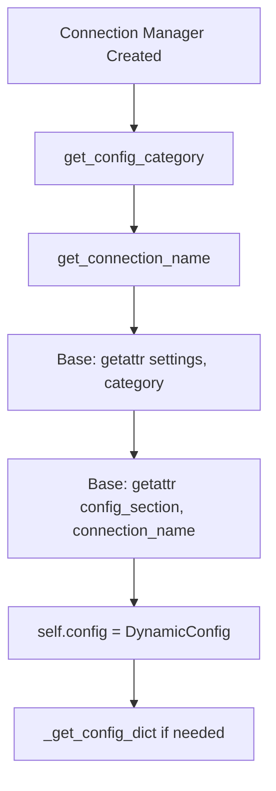
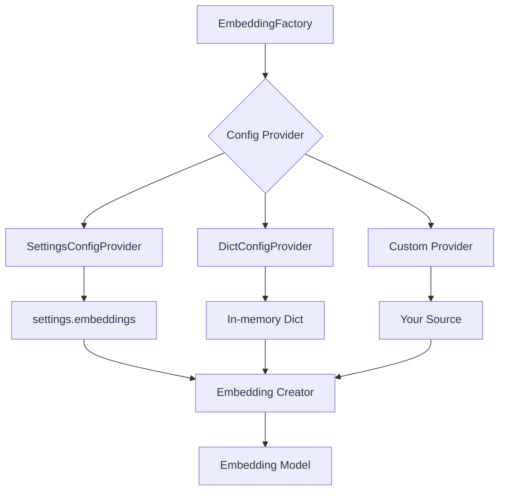

# Configuration & Connection System Refactoring (Feb 3, 2026)

> **Major refactoring** to simplify configuration access, improve maintainability, and implement Strategy Pattern for embeddings

## Table of Contents
- [Overview](#overview)
- [What Changed](#what-changed)
- [Configuration System Updates](#configuration-system-updates)
- [Connection Manager Updates](#connection-manager-updates)
- [Embedding System Refactoring](#embedding-system-refactoring)
- [Ingestion Service Migration](#ingestion-service-migration)
- [Migration Guide](#migration-guide)
- [Benefits](#benefits)

---

## Overview

This refactoring eliminated configuration wrapper classes, simplified connection managers, and implemented the Strategy Pattern for embedding configuration. The result is cleaner, more maintainable code with better separation of concerns.

### Key Changes Summary

| Component | Before | After | Impact |
|-----------|--------|-------|--------|
| **Config Access** | `DatabaseConfig(settings.db)` wrapper | Direct `settings.db.mongodb` access | Simpler, less duplication |
| **Connection Managers** | Hardcoded type mappings | `get_config_category()` method | More maintainable |
| **Embeddings** | Factory manages config retrieval | Strategy Pattern with providers | Testable, flexible |
| **Ingestion** | In `services/` package | In `infrastructure/` package | Better architecture |
| **Vector Stores** | `DynamicConfig` objects | Dictionary configs via `_get_config_dict()` | Consistent interface |

---

## What Changed

### 1. Configuration System Simplification

**Before:**
```python
# Old way - wrapper classes
from app.core.config.sources.database import DatabaseConfig

db_config = DatabaseConfig(settings.db)
mongo_config = db_config.mongodb  # Extra layer
```

**After:**
```python
# New way - direct access
from app.core.config.framework.settings import settings

mongo_config = settings.db.mongodb  # Direct access
```

**Files Deleted:**
- `src/app/core/config/sources/database.py`
- `src/app/core/config/sources/vector.py`
- `src/app/core/config/sources/external.py`

### 2. Connection Manager Pattern

**Before:**
```python
class MongoDBConnectionManager(BaseConnectionManager):
    def __init__(self):
        super().__init__()
        # Hardcoded config retrieval in base class
```

**After:**
```python
class MongoDBConnectionManager(BaseConnectionManager):
    def get_connection_name(self) -> str:
        return ConnectionType.MONGODB.value  # 'mongodb'
    
    def get_config_category(self) -> str:
        return "db"  # Category in settings
    
    # Base class uses: settings.{category}.{connection_name}
    # Result: settings.db.mongodb
```

### 3. Embedding Factory Strategy Pattern

**Before:**
```python
# Factory managed config retrieval
EmbeddingFactory.get_embedding_model(
    EmbeddingType.OPENAI,
    embedding_config=some_config  # Factory decides fallback
)
```

**After:**
```python
# Strategy Pattern - pluggable config providers
from app.db.vector.providers import (
    EmbeddingFactory,
    SettingsConfigProvider,
    DictConfigProvider
)

# Production: uses SettingsConfigProvider by default
embedding = EmbeddingFactory.get_embedding_model(EmbeddingType.OPENAI)

# Testing: swap provider
EmbeddingFactory.set_config_provider(
    DictConfigProvider({
        EmbeddingType.OPENAI: {"api_key": "test-key"}
    })
)
embedding = EmbeddingFactory.get_embedding_model(EmbeddingType.OPENAI)
```

---

## Configuration System Updates

### Direct Settings Access Pattern

All configuration now follows this pattern:

```python
from app.core.config.framework.settings import settings

# Database configurations
mongodb_config = settings.db.mongodb
postgres_config = settings.db.postgres
redis_config = settings.db.redis

# Vector store configurations
qdrant_config = settings.vector.qdrant
pgvector_config = settings.vector.pgvector
chromadb_config = settings.vector.chromadb

# External service configurations
confluence_config = settings.external.confluence
jira_config = settings.external.jira

# Embedding configurations
openai_embedding = settings.embeddings.openai
huggingface_embedding = settings.embeddings.huggingface

# Data source configurations (renamed from data-sources to data)
data_sources = settings.data.sources  # List of data source configs
```

### Configuration Categories

Settings are now organized by category:

| Category | Setting Path | Configuration File | Purpose |
|----------|-------------|-------------------|---------|
| `db` | `settings.db` | `application-db.yaml` | Database connections |
| `vector` | `settings.vector` | `application-vector.yaml` | Vector stores |
| `external` | `settings.external` | `application-external.yaml` | External services |
| `embeddings` | `settings.embeddings` | `application-embeddings.yaml` | Embedding models |
| `data` | `settings.data` | `application-data.yaml` | Data sources |
| `llm` | `settings.llm` | `application-llm.yaml` | LLM providers |
| `app` | `settings.app` | `application-app.yaml` | App settings |

### Converting DynamicConfig to Dict

When you need a plain dictionary:

```python
from app.core.config.utils.config_converter import dynamic_config_to_dict

# Get config as DynamicConfig
config = settings.db.mongodb

# Convert to dictionary
config_dict = dynamic_config_to_dict(config)
# Result: {'host': 'localhost', 'port': 27017, ...}
```

---

## Connection Manager Updates

### The New Pattern

All connection managers now implement two key methods:

```python
from app.infrastructure.connections.base import BaseConnectionManager

class YourConnectionManager(BaseConnectionManager):
    
    def get_connection_name(self) -> str:
        """Return the config key name (e.g., 'mongodb', 'redis')."""
        return ConnectionType.YOUR_SERVICE.value
    
    def get_config_category(self) -> str:
        """Return the settings category ('db', 'vector', or 'external')."""
        return "db"  # or "vector" or "external"
    
    # Base class automatically constructs:
    # settings.{category}.{connection_name}
    # e.g., settings.db.mongodb
```

### Configuration Access in Connection Managers

Connection managers can access their config as a dictionary:

```python
class MongoDBConnectionManager(BaseConnectionManager):
    
    def validate_config(self) -> None:
        """Validate configuration."""
        config_dict = self._get_config_dict()  # Get as dictionary
        
        if not config_dict.get('host'):
            raise ValueError("MongoDB host is required")
    
    def connect(self):
        """Establish connection."""
        config_dict = self._get_config_dict()
        
        # Use dictionary access
        client = MongoClient(
            host=config_dict['host'],
            port=config_dict.get('port', 27017)
        )
```

### Updated Connection Managers

All connection managers have been updated:

**Database Connections:**
- ✅ `MongoDBConnectionManager` - `get_config_category()` returns `"db"`
- ✅ `RedisConnectionManager` - `get_config_category()` returns `"db"`
- ✅ `PostgresConnectionManager` - `get_config_category()` returns `"db"`

**Vector Store Connections:**
- ✅ `QdrantConnectionManager` - `get_config_category()` returns `"vector"`
- ✅ `ChromaDBConnectionManager` - `get_config_category()` returns `"vector"`
- ✅ `PgVectorConnectionManager` - `get_config_category()` returns `"vector"`

**External Service Connections:**
- ✅ `ConfluenceConnectionManager` - `get_config_category()` returns `"external"`
- ✅ `JiraConnectionManager` - `get_config_category()` returns `"external"`

### Base Connection Manager Flow



---

## Embedding System Refactoring

### Strategy Pattern Implementation

The embedding system now uses the Strategy Pattern for configuration management.

#### Architecture



### Config Provider Interface

```python
from abc import ABC, abstractmethod
from app.core.constants import EmbeddingType

class EmbeddingConfigProvider(ABC):
    """Abstract base for embedding configuration providers."""
    
    @abstractmethod
    def get_config(self, embedding_type: EmbeddingType) -> Dict[str, Any]:
        """Retrieve configuration for a specific embedding type."""
        pass
```

### Built-in Providers

#### 1. SettingsConfigProvider (Default)

Retrieves configurations from `settings.embeddings`:

```python
from app.db.vector.providers import SettingsConfigProvider

provider = SettingsConfigProvider()

# Gets config from settings.embeddings.openai
config = provider.get_config(EmbeddingType.OPENAI)
# Result: {'api_key': '...', 'model': 'text-embedding-ada-002', ...}
```

#### 2. DictConfigProvider (Testing)

Uses an in-memory dictionary:

```python
from app.db.vector.providers import DictConfigProvider

test_configs = {
    EmbeddingType.OPENAI: {
        'api_key': 'test-key-123',
        'model': 'test-model'
    },
    EmbeddingType.HUGGINGFACE: {
        'model': 'test-hf-model',
        'device': 'cpu'
    }
}

provider = DictConfigProvider(test_configs)
config = provider.get_config(EmbeddingType.OPENAI)
# Result: {'api_key': 'test-key-123', 'model': 'test-model'}
```

### Using the Embedding Factory

#### Production Usage

```python
from app.db.vector.providers import EmbeddingFactory
from app.core.constants import EmbeddingType

# Uses default SettingsConfigProvider
embedding = EmbeddingFactory.get_embedding_model(EmbeddingType.OPENAI)
```

#### Testing Usage

```python
from app.db.vector.providers import EmbeddingFactory, DictConfigProvider

# Create test config provider
test_provider = DictConfigProvider({
    EmbeddingType.OPENAI: {
        'api_key': 'test-key',
        'model': 'test-model'
    }
})

# Swap provider
EmbeddingFactory.set_config_provider(test_provider)

# Now uses test config
embedding = EmbeddingFactory.get_embedding_model(EmbeddingType.OPENAI)

# Reset to default
from app.db.vector.providers import SettingsConfigProvider
EmbeddingFactory.set_config_provider(SettingsConfigProvider())
```

#### Custom Provider

```python
from app.db.vector.providers import EmbeddingConfigProvider

class DatabaseConfigProvider(EmbeddingConfigProvider):
    """Load embedding configs from database."""
    
    def __init__(self, db_connection):
        self.db = db_connection
    
    def get_config(self, embedding_type: EmbeddingType) -> Dict[str, Any]:
        # Load from database
        config = self.db.query(
            "SELECT config FROM embedding_configs WHERE type = ?",
            embedding_type.value
        )
        return config

# Use it
db_provider = DatabaseConfigProvider(db_connection)
EmbeddingFactory.set_config_provider(db_provider)
```

### Benefits of Strategy Pattern

| Benefit | Description | Example |
|---------|-------------|---------|
| **Testability** | Easy to inject test configs | DictConfigProvider for unit tests |
| **Flexibility** | Swap config sources at runtime | Database, API, file-based configs |
| **Separation of Concerns** | Factory only creates, providers handle config | Clear responsibilities |
| **Extensibility** | Add new providers without changing factory | Custom providers for special cases |

---

## Ingestion Service Migration

### Location Change

**Before:**
```
src/app/services/ingestion/
    ├── base.py
    ├── file_ingestion_service.py
    ├── confluence_ingestion_service.py
    └── rag_data_provider.py
```

**After:**
```
src/app/infrastructure/ingestion/
    ├── base.py
    ├── file_ingestion_service.py
    ├── confluence_ingestion_service.py
    └── rag_data_provider.py
```

### Configuration Updates

The ingestion base class now accesses data source configs from the renamed YAML file:

**YAML File Changes:**
- Old: `resources/application-data-sources.yaml` with `dataSources` key
- New: `resources/application-data.yaml` with `sources` key

**Code Changes:**

```python
# In base.py
class BaseIngestionService(ABC):
    def __init__(self):
        # Old way
        # data_sources = settings.data_sources.dataSources
        
        # New way
        data_root = getattr(settings, 'data')
        data_sources_list = data_root.sources  # List of configs
        
        # Convert list to dict indexed by type
        data_sources_dict = {
            item.type.lower(): item 
            for item in data_sources_list
        }
        
        # Get config for this service type
        source_type_key = self.SOURCE_TYPE.value.lower()
        self.config = data_sources_dict[source_type_key]
```

### Import Updates

All imports have been updated:

```python
# Old imports
from app.services.ingestion.file_ingestion_service import FileIngestionService
from app.services.ingestion.rag_data_provider import RagDataProvider

# New imports
from app.infrastructure.ingestion.file_ingestion_service import FileIngestionService
from app.infrastructure.ingestion.rag_data_provider import RagDataProvider
```

---

## Migration Guide

### For Developers

#### 1. Update Configuration Access

**Replace wrapper classes with direct access:**

```python
# ❌ Old way - DELETE THIS
from app.core.config.sources.database import DatabaseConfig
db_config = DatabaseConfig(settings.db)
mongo = db_config.mongodb

# ✅ New way - USE THIS
from app.core.config.framework.settings import settings
mongo = settings.db.mongodb
```

#### 2. Update Connection Manager Creation

**If you have custom connection managers, add the new methods:**

```python
class YourConnectionManager(BaseConnectionManager):
    
    # ADD THIS METHOD
    def get_config_category(self) -> str:
        """Return 'db', 'vector', or 'external'."""
        return "db"  # Choose appropriate category
    
    # UPDATE EXISTING METHODS to use _get_config_dict()
    def validate_config(self) -> None:
        config_dict = self._get_config_dict()  # Get as dict
        # Use config_dict instead of self.config
```

#### 3. Update Embedding Usage

**No changes needed for basic usage:**

```python
# This still works
embedding = EmbeddingFactory.get_embedding_model(EmbeddingType.OPENAI)
```

**For testing, use the new provider pattern:**

```python
# Old way (no longer works)
embedding = EmbeddingFactory.get_embedding_model(
    EmbeddingType.OPENAI,
    embedding_config={'api_key': 'test'}
)

# New way
from app.db.vector.providers import DictConfigProvider
EmbeddingFactory.set_config_provider(
    DictConfigProvider({
        EmbeddingType.OPENAI: {'api_key': 'test'}
    })
)
embedding = EmbeddingFactory.get_embedding_model(EmbeddingType.OPENAI)
```

#### 4. Update Ingestion Imports

```python
# ❌ Old
from app.services.ingestion.file_ingestion_service import FileIngestionService

# ✅ New
from app.infrastructure.ingestion.file_ingestion_service import FileIngestionService
```

#### 5. Update Vector Store Usage

**If you were accessing vector store configs directly:**

```python
# ❌ Old way - might break with DynamicConfig
config = vector_store.config
url = config['url']  # Error if config is DynamicConfig

# ✅ New way - get as dict first
from app.db.vector.qdrant import QdrantDB
qdrant = QdrantDB()
config_dict = qdrant._connection_manager._get_config_dict()
url = config_dict['url']  # Always works
```

### For Tests

#### Update Test Mocks

```python
# Old way - mocking wrapper classes
@patch('app.core.config.sources.database.DatabaseConfig')
def test_something(mock_db_config):
    pass

# New way - mock settings directly
@patch('app.infrastructure.connections.base.base_connection_manager.settings')
def test_something(mock_settings):
    mock_settings.db.mongodb = Mock(host='test-host')
```

#### Use DictConfigProvider for Embedding Tests

```python
import pytest
from app.db.vector.providers import EmbeddingFactory, DictConfigProvider

@pytest.fixture
def test_embedding_config():
    """Fixture for test embedding configuration."""
    test_configs = {
        EmbeddingType.OPENAI: {
            'api_key': 'test-key',
            'model': 'test-model'
        }
    }
    provider = DictConfigProvider(test_configs)
    EmbeddingFactory.set_config_provider(provider)
    
    yield
    
    # Cleanup: reset to default
    from app.db.vector.providers import SettingsConfigProvider
    EmbeddingFactory.set_config_provider(SettingsConfigProvider())

def test_embedding_creation(test_embedding_config):
    """Test embedding creation with test config."""
    embedding = EmbeddingFactory.get_embedding_model(EmbeddingType.OPENAI)
    assert embedding is not None
```

---

## Benefits

### 1. Simplified Code

**Before:** 3 wrapper classes + hardcoded mappings + mixed patterns
**After:** Direct settings access + consistent patterns

**Lines of Code Reduction:**
- Removed ~300 lines of wrapper code
- Removed hardcoded type mappings
- Simplified connection manager initialization

### 2. Better Maintainability

| Aspect | Before | After |
|--------|--------|-------|
| **Adding New Connection** | Update registry, mappings, imports | Add `get_config_category()`, done |
| **Changing Config Structure** | Update wrapper class | Update YAML only |
| **Testing** | Mock multiple layers | Mock settings or inject provider |
| **Understanding Flow** | Follow through wrappers | Direct path clear |

### 3. Improved Testability

```python
# Embedding tests - easy to inject test configs
EmbeddingFactory.set_config_provider(test_provider)

# Connection tests - mock settings directly
mock_settings.db.mongodb = test_config

# No need for complex wrapper mocking
```

### 4. Type Safety

```python
# Old - loosely typed
config = some_wrapper.get_config('mongodb')  # What type is this?

# New - strongly typed
config = settings.db.mongodb  # IDE knows structure
```

### 5. Flexibility

```python
# Can easily swap embedding config source
EmbeddingFactory.set_config_provider(DatabaseConfigProvider())

# Can add new categories without code changes
# Just add to YAML and access: settings.new_category.item
```

---

## Breaking Changes

### ⚠️ Important: Update Your Code

These changes are **breaking changes**. You must update:

1. ✅ **All imports** from `app.services.ingestion.*` to `app.infrastructure.ingestion.*`
2. ✅ **All usage** of `DatabaseConfig`, `VectorConfig`, `ExternalConfig` wrapper classes
3. ✅ **Custom connection managers** must implement `get_config_category()`
4. ✅ **Embedding tests** should use new `DictConfigProvider` pattern
5. ✅ **Data source config** references to use `settings.data.sources` instead of `settings.data_sources.dataSources`

### Automated Migration Script

Run this to find files that need updates:

```bash
# Find old ingestion imports
grep -r "from app.services.ingestion" src/

# Find old config wrapper imports
grep -r "from app.core.config.sources" src/

# Find old data source references
grep -r "data_sources.dataSources" src/
```

---

## Summary

This refactoring modernizes the configuration and connection management systems with:

✅ **Direct settings access** - No more wrapper classes
✅ **Maintainable connection pattern** - Clear `get_config_category()` method
✅ **Strategy Pattern for embeddings** - Testable and flexible
✅ **Better architecture** - Ingestion in infrastructure layer
✅ **Cleaner code** - Less duplication, clearer patterns

The system is now more maintainable, testable, and follows better software engineering principles.

---

**Last Updated:** February 3, 2026
**Version:** 2.0.0
**Status:** ✅ Complete
