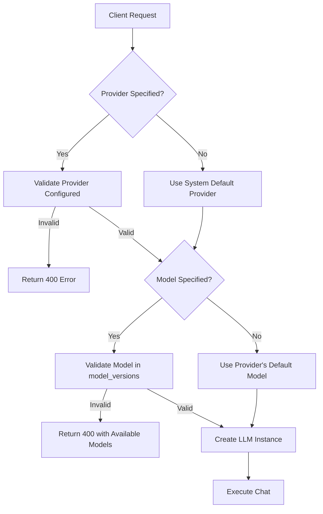

# LLM Model Validation

## Overview

AgentHub now supports **dynamic LLM provider and model selection** with automatic validation. Clients can specify which LLM provider and model to use for each request, or fall back to system defaults.

## Features

### 1. Provider Listing API

Get all configured LLM providers:

```bash
GET /api/v1/llm/providers
```

Response:
```json
{
  "success": true,
  "providers": [
    {
      "name": "openai",
      "display_name": "OpenAI",
      "is_default": true,
      "default_model": "gpt-4o-mini",
      "model_versions": [
        "gpt-4o-mini",
        "gpt-4o",
        "gpt-4-turbo",
        "gpt-5",
        "gpt-5-mini",
        "gpt-5-turbo",
        "o1",
        "o3-mini"
      ]
    },
    {
      "name": "anthropic",
      "display_name": "Anthropic",
      "is_default": false,
      "default_model": "claude-sonnet-4-5",
      "model_versions": [
        "claude-sonnet-4-5",
        "claude-opus-4-5",
        "claude-haiku-3.7"
      ]
    }
  ],
  "count": 2
}
```

### 2. Provider Details API

Get detailed information about a specific provider:

```bash
GET /api/v1/llm/providers/{provider_name}
```

Response:
```json
{
  "success": true,
  "provider": {
    "name": "openai",
    "display_name": "OpenAI",
    "is_default": true,
    "default_model": "gpt-4o-mini",
    "model_versions": [...],
    "base_url": "https://api.openai.com/v1",
    "timeout": 600,
    "max_tokens": 500000
  }
}
```

### 3. Model Validation Decorator

All chat endpoints now validate provider and model parameters using the `@validate_llm_params` decorator:

```python
from app.core.decorators import validate_llm_params

@router.post("/message")
@validate_llm_params
async def send_message(req: ChatRequest):
    # req.provider and req.model are guaranteed to be valid here
    response = await chat_service.chat(
        message=req.message,
        provider=req.provider,
        model=req.model
    )
```

## Client Usage

### Option 1: Use System Defaults

Send a request without specifying provider or model:

```bash
curl -X POST http://localhost:8000/api/v1/chat/message \
  -H "Authorization: Bearer YOUR_TOKEN" \
  -H "Content-Type: application/json" \
  -d '{
    "message": "What is AI?"
  }'
```

The system will use:
- Default provider: `openai` (from `application-llm.yaml`)
- Default model: `gpt-4o-mini` (from OpenAI's default_model)

### Option 2: Specify Provider

Use a specific provider with its default model:

```bash
curl -X POST http://localhost:8000/api/v1/chat/message \
  -H "Authorization: Bearer YOUR_TOKEN" \
  -H "Content-Type: application/json" \
  -d '{
    "message": "What is AI?",
    "provider": "anthropic"
  }'
```

The system will use:
- Provider: `anthropic` ✅ (validated against configured providers)
- Model: `claude-sonnet-4-5` (Anthropic's default_model)

### Option 3: Specify Provider and Model

Use a specific provider with a specific model:

```bash
curl -X POST http://localhost:8000/api/v1/chat/message \
  -H "Authorization: Bearer YOUR_TOKEN" \
  -H "Content-Type: application/json" \
  -d '{
    "message": "What is AI?",
    "provider": "openai",
    "model": "gpt-5"
  }'
```

The system will:
1. ✅ Validate `openai` is configured (has API key)
2. ✅ Validate `gpt-5` is in OpenAI's `model_versions` list
3. ✅ Create LLM instance with validated parameters

### Option 4: Invalid Model (Error Handling)

```bash
curl -X POST http://localhost:8000/api/v1/chat/message \
  -H "Authorization: Bearer YOUR_TOKEN" \
  -H "Content-Type: application/json" \
  -d '{
    "message": "What is AI?",
    "provider": "openai",
    "model": "gpt-2"
  }'
```

Response (HTTP 400):
```json
{
  "error": {
    "message": "Model 'gpt-2' is not supported by provider 'openai'. Available models: gpt-4o-mini, gpt-4o, gpt-4-turbo, gpt-5, gpt-5-mini, gpt-5-turbo, o1, o3-mini",
    "code": "BAD_REQUEST",
    "status": 400
  }
}
```

## Validation Flow



## Configuration

Models are defined in `resources/application-llm.yaml`:

```yaml
llm:
  default:
    provider: openai
    model: gpt-4o-mini
  
  providers:
    openai:
      display_name: "OpenAI"
      api_key: ${OPENAI_API_KEY}
      base_url: https://api.openai.com/v1
      default_model: gpt-4o-mini
      model_versions:
        - gpt-4o-mini
        - gpt-4o
        - gpt-4-turbo
        - gpt-5
        - gpt-5-mini
        - gpt-5-turbo
        - o1
        - o3-mini
      timeout: 600
      max_tokens: 500000
    
    anthropic:
      display_name: "Anthropic"
      api_key: ${ANTHROPIC_API_KEY}
      default_model: claude-sonnet-4-5
      model_versions:
        - claude-sonnet-4-5
        - claude-opus-4-5
        - claude-haiku-3.7
      timeout: 300
      max_tokens: 200000
```

## Architecture

### Service Layer

`src/app/services/llm_service.py`:
```python
class LLMService:
    @staticmethod
    def validate_model_for_provider(provider_name: str, model: str = None) -> str:
        """
        Validate model is supported by provider.
        
        Args:
            provider_name: Name of the LLM provider (e.g., "openai")
            model: Optional model name. If None, returns provider's default
        
        Returns:
            Validated model name
        
        Raises:
            ValueError: If provider not found/configured or model not supported
        """
```

### Decorator

`src/app/core/decorators/llm_validation.py`:
```python
def validate_llm_params(func: Callable) -> Callable:
    """
    Decorator to validate LLM provider and model parameters in FastAPI requests.
    
    - Extracts provider and model from request body
    - Falls back to system defaults when not provided
    - Validates using LLMService.validate_model_for_provider()
    - Updates request with validated values
    - Raises HTTPException 400 on validation errors
    """
```

### Request Schema

`src/app/schemas/chat.py`:
```python
class ChatRequest(BaseModel):
    message: str
    session_id: Optional[str] = None
    provider: Optional[str] = Field(
        None,
        description="LLM provider to use (e.g., 'openai', 'anthropic'). Falls back to system default if not provided."
    )
    model: Optional[str] = Field(
        None,
        description="Specific model to use (e.g., 'gpt-5', 'claude-sonnet-4-5'). Falls back to provider's default if not provided."
    )
    metadata: Optional[Dict[str, Any]] = None
```

## Error Responses

### Provider Not Found (404)
```json
{
  "error": {
    "message": "Provider 'invalid' not found in configuration",
    "code": "NOT_FOUND",
    "status": 404
  }
}
```

### Provider Not Configured (400)
```json
{
  "error": {
    "message": "Provider 'groq' not configured (missing API key)",
    "code": "BAD_REQUEST",
    "status": 400
  }
}
```

### Invalid Model (400)
```json
{
  "error": {
    "message": "Model 'gpt-2' is not supported by provider 'openai'. Available models: gpt-4o-mini, gpt-4o, ...",
    "code": "BAD_REQUEST",
    "status": 400
  }
}
```

### Server Error (500)
```json
{
  "error": {
    "message": "Failed to validate LLM parameters. Please try again.",
    "code": "INTERNAL_ERROR",
    "status": 500
  }
}
```

## Testing

### Unit Tests

**Service Tests** (`tests/unit/services/test_llm_service.py`):
- 9 provider configuration validation tests
- 8 model validation tests
- 4 provider listing tests
- 4 provider details tests

**Decorator Tests** (`tests/unit/core/test_llm_validation_decorator.py`):
- 9 async decorator tests
- 2 sync decorator tests

**API Tests** (`tests/unit/api/test_llm_endpoints.py`):
- 3 list providers endpoint tests
- 4 get provider details endpoint tests

Total: **42 tests passing** ✅

### Running Tests

```bash
# Run all LLM-related tests
pytest tests/unit/services/test_llm_service.py \
       tests/unit/core/test_llm_validation_decorator.py \
       tests/unit/api/test_llm_endpoints.py -v

# Run only model validation tests
pytest tests/unit/services/test_llm_service.py::TestModelValidation -v

# Run only decorator tests
pytest tests/unit/core/test_llm_validation_decorator.py -v
```

## Benefits

1. **Flexibility**: Clients can choose optimal models for their use case
2. **Validation**: Prevents invalid provider/model combinations
3. **Fallback**: Automatic defaults when parameters not provided
4. **Error Handling**: Clear error messages with available options
5. **Discovery**: API endpoints to explore available providers and models
6. **Type Safety**: Pydantic validation ensures correct data types
7. **Logging**: Comprehensive logging for debugging and monitoring

## Future Enhancements

- [ ] Cost tracking per provider/model
- [ ] Rate limiting per provider
- [ ] Model performance analytics
- [ ] A/B testing between models
- [ ] Session-level provider/model persistence
- [ ] Message-level provider/model tracking
- [ ] Dynamic model loading/unloading
- [ ] Provider health checks
